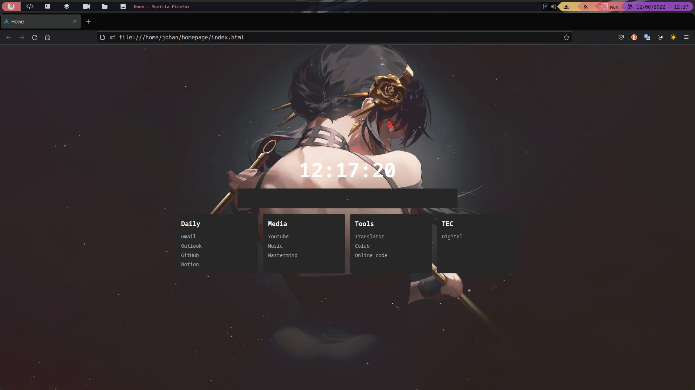
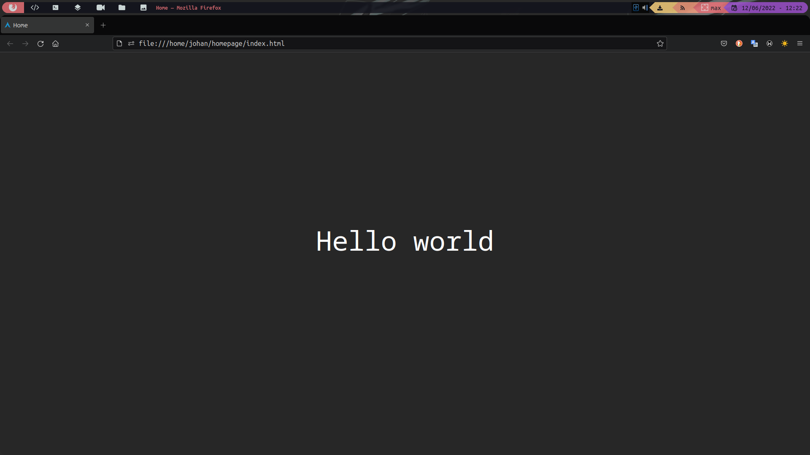

  # Custom home page
  
  ## Table-of-Contents
  * [Description](#description)
  * [Installation](#installation)
  * [Tests](#tests)
  * [Usage](#usage)
  * [Questions](#questions)
  ---

  ## [Description](#table-of-contents)
  This is a custom home page for web browsers.

  ---

  ## [Installation](#table-of-contents)
  Steps required to install project and how to get the development environment running:
  
  - ``git clone`` the repository in your local files.
  - Save the folder in a secure path that you don't delete it. 
  - Copy the direction of this path and copy that in the custom home page section in your browser settings (using protocol file://).

  ---

  ## [Tests](#table-of-contents)
  
  ### Home page 
  

  ### Search box
  

  ---

  ## [Usage](#table-of-contents)
  To search with this home page press the ``space`` key and type your text to search.

  By default this home page use Duck Duck Go to search, you can change this config in the ``index.html``.

  ---

  ## [Questions](#table-of-contents)
  For any questions, please contact me with the information below:

  Github: [Johanx22x](https://github.com/Johanx22x)

  Email: <a href="mailto:johanrodsa2210@gmail.com">johanrodsa2210@gmail.com</a>
